# video-transcoder

**AI-powered Wiki:** https://deepwiki.com/oleg-milantiev/video-transcoder

## 📚 Documentation

### Key Documents
- **[AGENTS.md](AGENTS.md)** — Architecture overview, DDD patterns, developer workflows, and integration guide for AI coding agents
- **[TASK_STATE_FLOW.md](TASK_STATE_FLOW.md)** — Task lifecycle and state transitions (DDD)
- **[EVENTS.md](EVENTS.md)** — Event-driven architecture and message flows
- **[frontend.md](frontend.md)** — Frontend architecture and Vue SPA modules
- **[develop/e2e/README.md](develop/e2e/README.md)** — End-to-end testing guide with Playwright
- **[grafana/README.md](grafana/README.md)** — Grafana dashboard configuration for monitoring logs and errors

## По-русски

Проект задуман мною как самообразовательный, но если дойдёт до запуска, может оказаться кому-то полезен как масштабируемый (или нет, по желанию) транскодер видео. Хочу собрать в него, опробовать в нём руками:

- terraform в яндекс (или другое) облако:
  - с autoscale заказом воркеров
  - k3s на мастер ноде или managed kubernetes cluster
  - postgresql на мастер ноде или managed postgresql cluster
  - redis на мастер ноде
  - mercure для realtime нотификаций
  - сети, подсети, sa, firewall
  - grafana, loki, promtail для логов и алертов
  - s3-хранилище для видео
- kubernetes с его ingress, развёртыванием, поддержанием и масштабированием подов
- VueJS статик front
- Symfony API
- autoscale Symfony Messenger Consumer с ffmpeg
- потом Laravel API
- потом autoscale Laravel *** Async Consumer с ffmpeg

Но его можно использовать в простой dev развёртке, состоящей из:
- docker-compose
  - nginx
  - php-fpm
  - postgresql
  - redis
  - ffmpeg воркер meta и preview
  - N ffmpeg-transcoder workers
  - cron шедулера и garbage collector
  - mercure
  - grafana, promtail, loki

Пример такой сборки в prod/

### Сценарий использования

#### Авторизация

Гость может **авторизоваться** (без регистрации) и **выйти** из сайта.

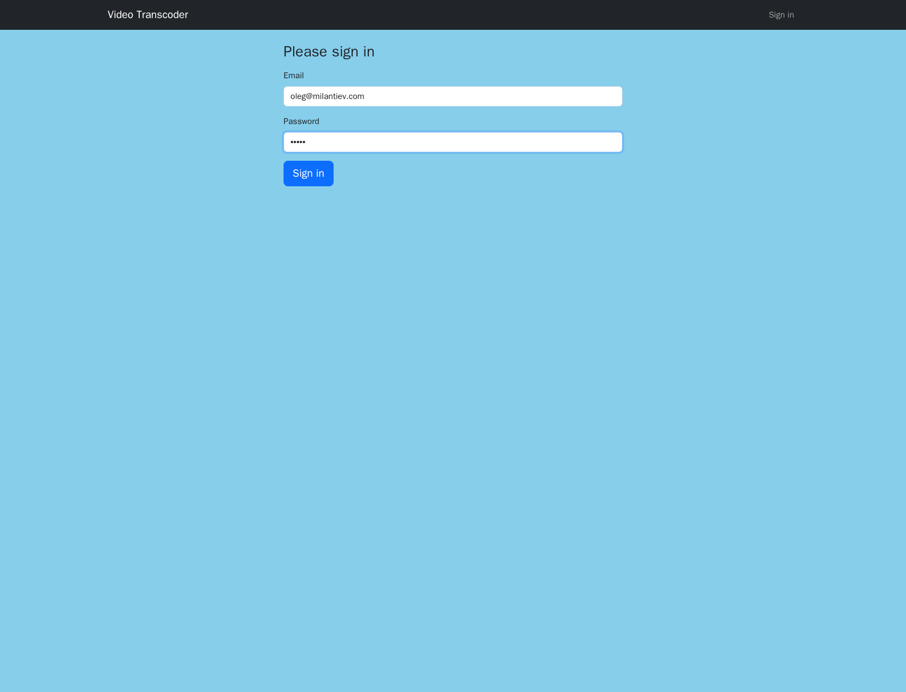

#### Пользователь (User)

Авторизованный **пользователь** с обычными **правами** обладает списком его **видео**.
Он может:

- загружать видео
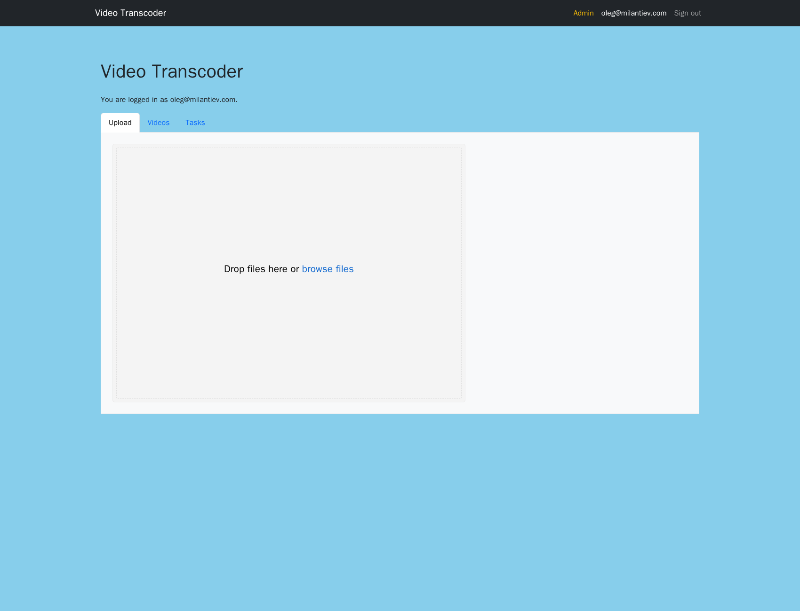
- просматривать список видео
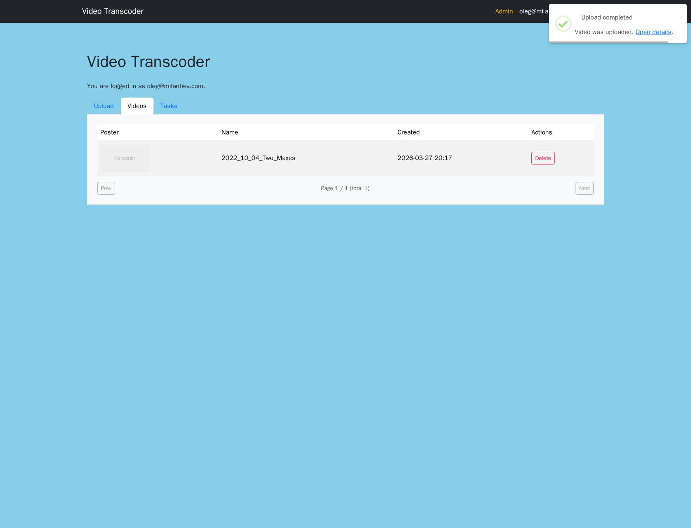
- просматривать и редактировать некоторые свойства видео
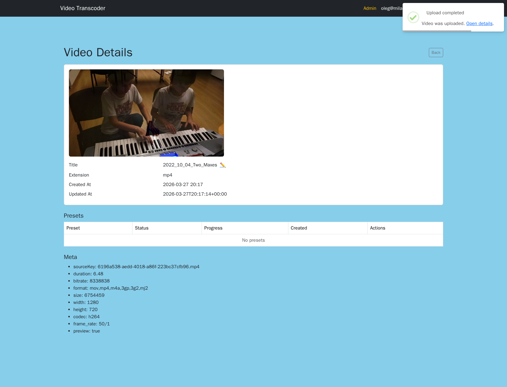
- удалять видео
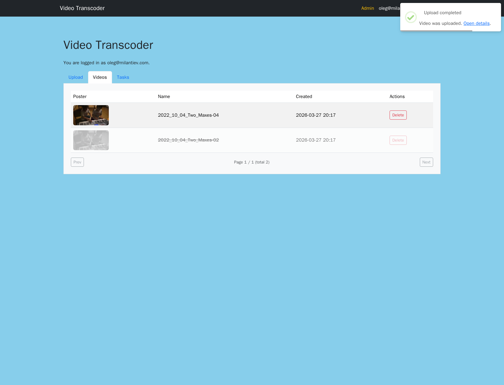
- ставить **задачу** на транскодировку видео в выбранном **пресете**

- отменять задачу в процессе транскодировки
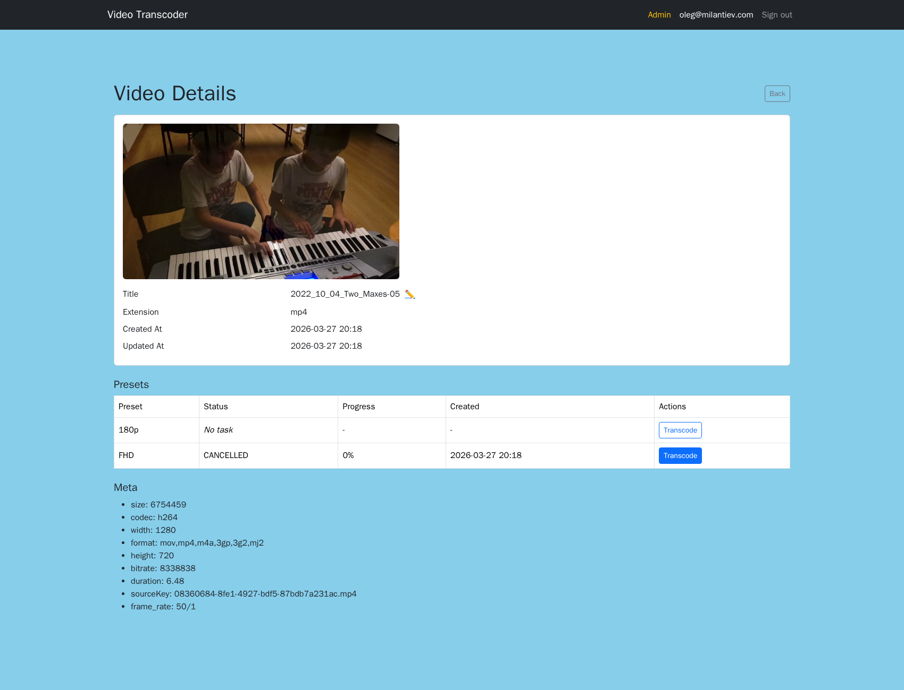
- следить за статусом задачи транскодирования
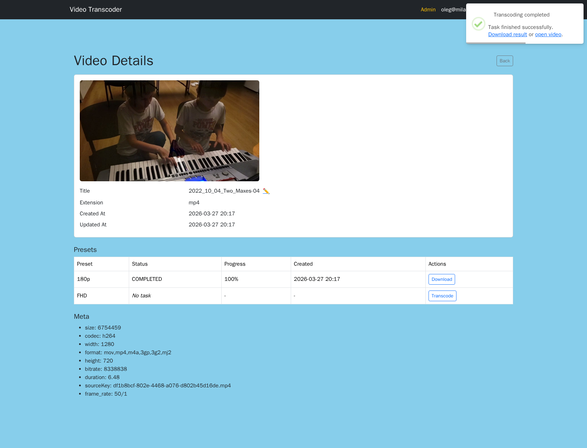
- скачивать результат
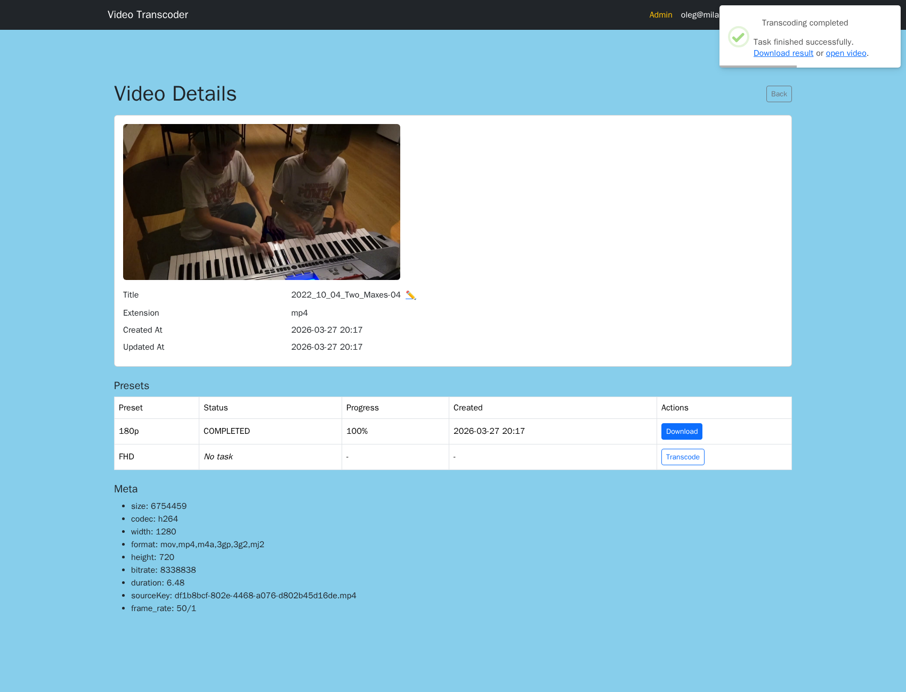

**Процесс транскодирования:**

Авторизованный пользователь с админскими правами видит EasyAdmin **админку** с CRUD:

- пользователей;
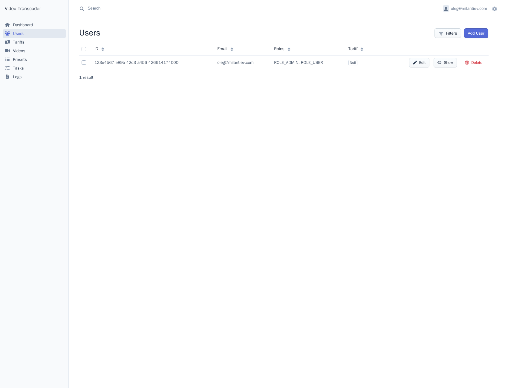
- видео с **превью**;
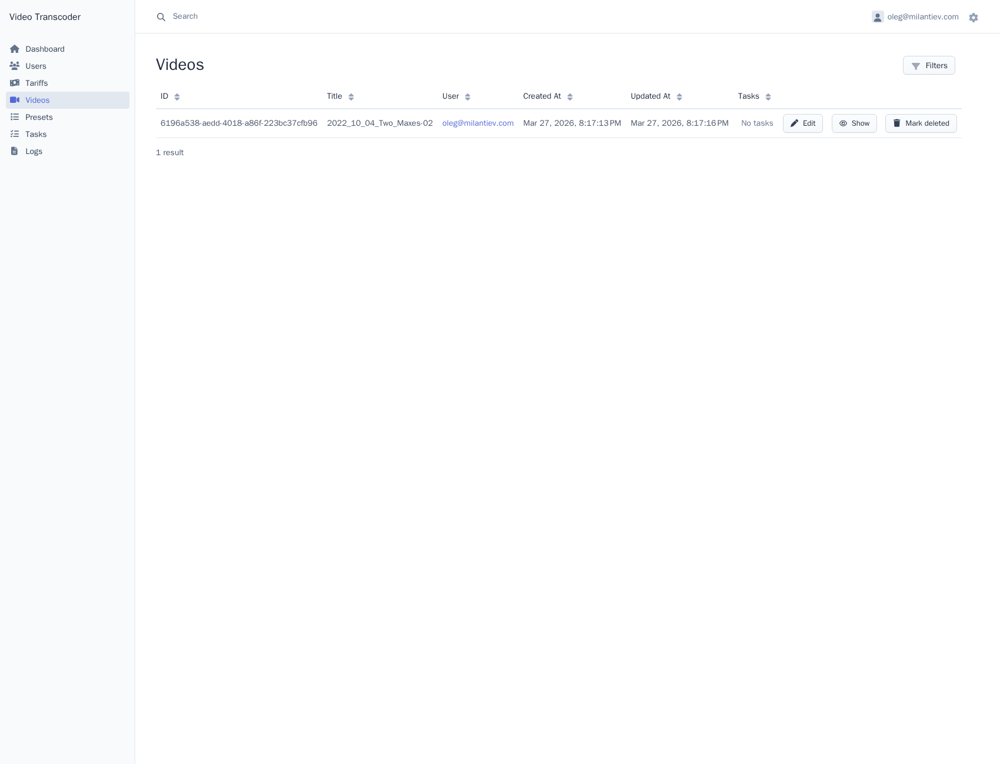
- список пресетов;
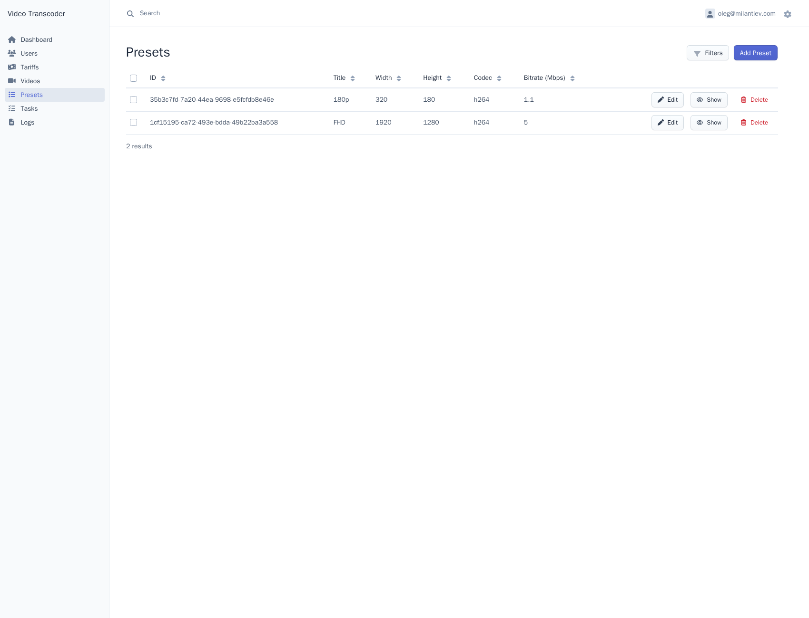
- текущих и законченных задач транскодирования (? с возможностью прервать задачу).
- **тарифы**
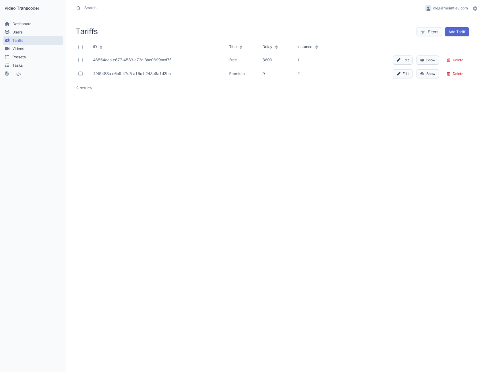
- **логи**
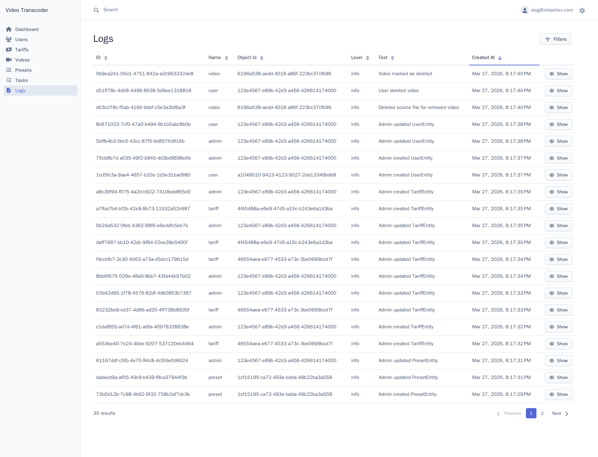

### Ролевая модель

**Гость**

- Просмотр лендинга и возможностей сервиса.
- Авторизация без классической регистрации.

**Пользователь (User)**

- Управление личной библиотекой видео (загрузка, редактирование метаданных, удаление).
- Выбор пресета (разрешение, кодек, битрейт) и постановка задачи на транскодирование.
- Управление активными задачами (мониторинг прогресса в реальном времени, отмена).
- Доступ к скачиванию обработанных файлов.

**Администратор (Admin)**

- Полный CRUD пользователей и медиаконтента.
- Управление глобальным справочником пресетов транскодирования и тарифами.
- Мониторинг общей очереди задач и инфраструктурный контроль (? прерывание зависших процессов).

### Бизнес модель

#### Ресурсная политика и лимиты (Quotas)

**Хранение:** Дифференцированные лимиты на объем S3-хранилища для исходников и результат транскода.

**Производительность:** Ограничение на количество одновременно выполняемых (параллельных) задач для одного пользователя. Ограничение на частоту запуска задач.

**Жизненный цикл данных:** Автоматическая очистка временных файлов и исходников по истечении заданного срока (Retention Policy). Watchdog зависших процессов.

#### Монетизация и тарифная сетка (Value Proposition)

**Free Tier (Self-education base):** Ограничение по качеству и длительности, низкий приоритет в очереди RabbitMQ, лимит на 1 активную задачу.

**Pay-per-minute / Subscription (Optional):** Доступ к тяжелым пресетам (4K, HEVC) и длинным видео, высокий приоритет обработки, увеличенное дисковое пространство, параллелизм задач транскодирования.

#### Технологическая ценность (Operations)

**Scalability:** Эластичное потребление ресурсов облака (AutoScale) в зависимости от длины очереди задач.

**Reliability:** Гарантированная доставка задач через брокер сообщений и возобновление обработки при сбоях воркеров.

