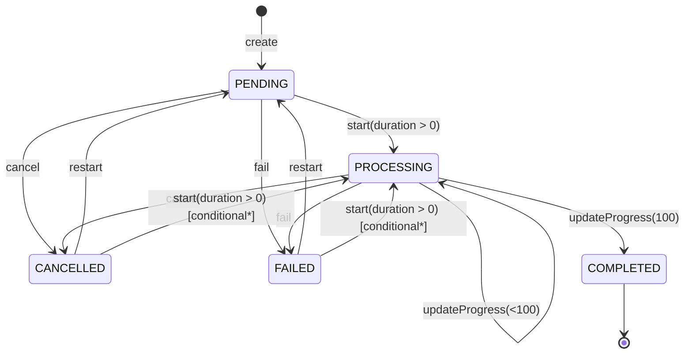

# Task State Flow (DDD)

Этот документ фиксирует все варианты жизненного цикла `Task` в текущей реализации.

## Source of truth

- Domain aggregate: `develop/symfony/src/Domain/Video/Entity/Task.php`
- Status rules: `develop/symfony/src/Domain/Video/ValueObject/TaskStatus.php`
- Date invariants: `develop/symfony/src/Domain/Video/ValueObject/TaskDates.php`
- Orchestration: `develop/symfony/src/Application/CommandHandler/Task/TranscodeVideoHandler.php`
- User cancel endpoint: `develop/symfony/src/Presentation/Controller/Api/TaskApiController.php`

## States

- `PENDING` - задача создана/ожидает запуска.
- `PROCESSING` - транскодирование выполняется.
- `COMPLETED` - успешно завершена.
- `FAILED` - завершена с ошибкой.
- `CANCELLED` - отменена пользователем или системой.

## Domain transitions

### Allowed transitions

- `null -> PENDING`
  - через `Task::create(...)`
- `FAILED|CANCELLED -> PENDING`
  - через `Task::restart()`
- `PENDING|FAILED|CANCELLED -> PROCESSING`
  - через `Task::start(?float $videoDuration)` при `videoDuration > 0`
- `PROCESSING -> PROCESSING`
  - через `Task::updateProgress(...)` для значений `< 100`
- `PROCESSING -> COMPLETED`
  - через `Task::updateProgress(100)`
- `PENDING|PROCESSING -> CANCELLED`
  - через `Task::cancel()`
- `PENDING|PROCESSING -> FAILED`
  - через `Task::fail()`

### Forbidden transitions (aggregate throws)

- `COMPLETED -> *` (restart/start/cancel/fail/progress)
- `FAILED -> CANCELLED` (прямой переход)
- `CANCELLED -> FAILED` (прямой переход)
- `PENDING -> COMPLETED` (без `PROCESSING`)
- Любой `updateProgress(...)` из статуса, отличного от `PROCESSING`
- Любой `start(...)` при `videoDuration <= 0` или `null`

## Transition matrix

| Current | Action | Condition | Next | Result |
|---|---|---|---|---|
| none | `create` | always | `PENDING` | OK |
| `PENDING` | `start` | duration > 0 | `PROCESSING` | OK |
| `PENDING` | `cancel` | always | `CANCELLED` | OK |
| `PENDING` | `fail` | always | `FAILED` | OK |
| `PENDING` | `updateProgress` | any | - | exception |
| `PROCESSING` | `updateProgress` | 0..99 | `PROCESSING` | OK |
| `PROCESSING` | `updateProgress` | 100 | `COMPLETED` | OK |
| `PROCESSING` | `cancel` | always | `CANCELLED` | OK |
| `PROCESSING` | `fail` | always | `FAILED` | OK |
| `FAILED` | `restart` | always | `PENDING` | OK |
| `FAILED` | `start` | duration > 0 | `PROCESSING`* | conditional |
| `CANCELLED` | `restart` | always | `PENDING` | OK |
| `CANCELLED` | `start` | duration > 0 | `PROCESSING`* | conditional |
| `COMPLETED` | state/meta mutating action | any | - | exception |

`*` Примечание: `start()` дополнительно упирается в инварианты `TaskDates::markStarted()`.
Если `startedAt` уже был установлен раньше, прямой `start()` выбросит исключение дат.

## Runtime flows (application level)

### 1) Happy path

1. Пользователь инициирует старт транскода.
2. Создается новая задача (`PENDING`) или существующая `FAILED/CANCELLED` уходит в `restart -> PENDING`.
3. Планировщик выбирает задачу.
4. Воркeр делает `start(duration)` -> `PROCESSING`.
5. Прогресс обновляется в цикле.
6. На 100% задача становится `COMPLETED`.

### 2) Cancel before worker start

1. API `POST /api/task/{id}/cancel` получает `PENDING` задачу.
2. Контроллер может сразу перевести ее в `CANCELLED`.
3. Одновременно выставляется cancellation trigger.
4. Если воркер позже подхватит задачу, увидит trigger и завершит обработку без ffmpeg.

### 3) Cancel during processing

1. API ставит cancellation trigger.
2. Процесс ffmpeg периодически проверяет trigger.
3. При подтверждении отмены финализация сохраняет отчет и фиксирует `CANCELLED`.

### 4) Retry path

1. Пользователь снова запускает транскод той же пары video+preset.
2. Если найдена `FAILED/CANCELLED`, применяется `restart()`.
3. Дальше обычный путь `PENDING -> PROCESSING -> COMPLETED|FAILED|CANCELLED`.

### 5) Start blocked (no transition)

1. Воркeр читает задачу и проверяет `canStart(video->duration())`.
2. Если длительность `null` или `<= 0`, либо статус не подходит, переход не выполняется.
3. Состояние задачи остается прежним (обычно `PENDING`), пишется warning/event fail.

## Mermaid diagram

`conditional*`: прямой `start()` зависит не только от статуса и длительности, но и от `TaskDates`.

## DDD notes

- Источник правил переходов должен оставаться в агрегате `Task`.
- Application слой должен только оркестрировать сценарии (выбор задачи, locks, очереди, события).
- Для устойчивости домена рекомендуется использовать один канонический путь повторного запуска: `FAILED/CANCELLED -> restart -> start`.
