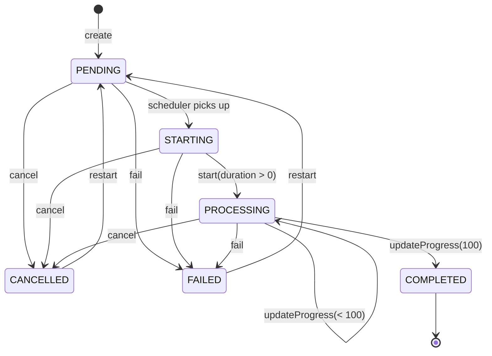

# Task State Flow

Этот документ фиксирует все варианты жизненного цикла `Task` в текущей реализации.

## Source of truth

- Domain aggregate: `develop/symfony/src/Domain/Video/Entity/Task.php`
- Status rules: `develop/symfony/src/Domain/Video/ValueObject/TaskStatus.php`
- Date invariants: `develop/symfony/src/Domain/Video/ValueObject/TaskDates.php`
- Orchestration: `develop/symfony/src/Application/CommandHandler/Task/TranscodeVideoHandler.php`
- User cancel endpoint: `develop/symfony/src/Presentation/Controller/Api/TaskApiController.php`

## States

| Статус | Описание |
|---|---|
| `PENDING` | Задача создана или перезапущена — ожидает планировщика |
| `STARTING` | Планировщик выбрал задачу — воркер ещё не запустил ffmpeg |
| `PROCESSING` | ffmpeg активно транскодирует |
| `COMPLETED` | Успешно завершена |
| `FAILED` | Завершена с ошибкой |
| `CANCELLED` | Отменена пользователем или системой |
| `DELETED` | Помечена удалённой |

## Инвариант startedAt

`startedAt` — audit-метка **последнего** фактического начала обработки ffmpeg.

| Событие | Что происходит с `startedAt` |
|---|---|
| Первый `start()` (было `null`) | `null → NOW` |
| Повторный `start()` после restart (было `NOT NULL`) | `NOT NULL → NOW` (перезаписывается) |
| `restart()` | не изменяется (`touch()` обновляет только `updatedAt`) |
| `fail()` / `cancel()` / `updateProgress()` | не изменяется |

**Правила:**
- `startedAt` **никогда не обнуляется** — единожды записанное значение только обновляется.
- `TaskDates::markStarted()` вызывается при **каждом** переходе `STARTING → PROCESSING` и всегда перезаписывает `startedAt`.
- `touch()` никогда не трогает `startedAt`.

## Domain transitions

### Allowed transitions

| Откуда | Метод | Условие | Куда |
|---|---|---|---|
| _(none)_ | `Task::create()` | — | `PENDING` |
| `PENDING` | `Task::cancel()` | — | `CANCELLED` |
| `PENDING` | `Task::fail()` | — | `FAILED` |
| `PENDING` | _(планировщик)_ | — | `STARTING` |
| `STARTING` | `Task::cancel()` | — | `CANCELLED` |
| `STARTING` | `Task::fail()` | — | `FAILED` |
| `STARTING` | `Task::start(duration)` | duration > 0 | `PROCESSING` |
| `PROCESSING` | `Task::updateProgress(n)` | n < 100 | `PROCESSING` |
| `PROCESSING` | `Task::updateProgress(100)` | — | `COMPLETED` |
| `PROCESSING` | `Task::cancel()` | — | `CANCELLED` |
| `PROCESSING` | `Task::fail()` | — | `FAILED` |
| `FAILED` | `Task::restart()` | — | `PENDING` |
| `CANCELLED` | `Task::restart()` | — | `PENDING` |

### Forbidden / guarded transitions

- `COMPLETED → *` — любой мутирующий вызов выбрасывает исключение.
- `PENDING/STARTING → PROCESSING` напрямую не допускается — только через `STARTING → start()`.
- `FAILED/CANCELLED → STARTING` напрямую запрещён — только через `restart() → PENDING`.
- `start()` при `videoDuration <= 0` или `null` — выбрасывает `DomainException`.
- `updateProgress(...)` из любого статуса кроме `PROCESSING` — выбрасывает `DomainException`.
- Повторный `markStarted()` на `TaskDates` — выбрасывает `InvalidTaskDates`.

## canStart / canBeCancelled helpers

```
Task::canStart(duration):
  deleted == true          → false
  status != STARTING       → false
  duration <= 0 || null    → false
  иначе                    → true

Task::canBeCancelled():
  deleted == true                               → false
  status in {PENDING, STARTING, PROCESSING}     → true
  иначе                                         → false
```

## Runtime flows (application level)

### 1) Happy path

```
create() → PENDING
           ↓ планировщик
         STARTING
           ↓ ffmpeg-transcode - start(duration)
         PROCESSING
           ↓ ffmpeg-transcode - updateProgress(100)
         COMPLETED
```

### 2) Cancel before ffmpeg start

1. API `POST /api/task/{id}/cancel` получает задачу в статусе `PENDING` или `STARTING`.
2. Контроллер вычисляет `cancelledNow = status in {PENDING, STARTING}`.
3. Если `cancelledNow`, задача сразу переходит в `CANCELLED`.
4. В любом случае выставляется cancellation trigger.
5. Если воркер позже подхватит задачу, увидит trigger и завершит без ffmpeg.

### 3) Cancel during processing

1. API выставляет cancellation trigger (задача остаётся `PROCESSING`).
2. Цикл ffmpeg периодически проверяет trigger.
3. При обнаружении финализация сохраняет отчёт и фиксирует `CANCELLED`.

### 4) Retry path

```
FAILED/CANCELLED → restart() → PENDING
                               ↓ планировщик
                             STARTING
                               ↓ start(duration)
                             PROCESSING
                               ↓
                           COMPLETED / FAILED / CANCELLED
```

### 5) Start blocked (no transition)

1. Воркер читает задачу и проверяет `canStart(video->duration())`.
2. Если статус не `STARTING` или длительность `null`/`<= 0` — переход не выполняется.
3. Задача остаётся в текущем статусе, пишется warning-лог и event `TranscodeVideoFail`.

## Mermaid diagram



## DDD notes

- Источник правил переходов — агрегат `Task`.
- Application слой только оркестрирует (выбор задачи, locks, очереди, события).
- `startedAt` — audit-метка последнего ffmpeg-запуска; **никогда не обнуляется**, перезаписывается при каждом `start()`.
- `restart()` не трогает `startedAt`; только `start()` обновляет его.
- Канонический путь повторного запуска: `FAILED/CANCELLED → restart() → PENDING → STARTING → start()`.
